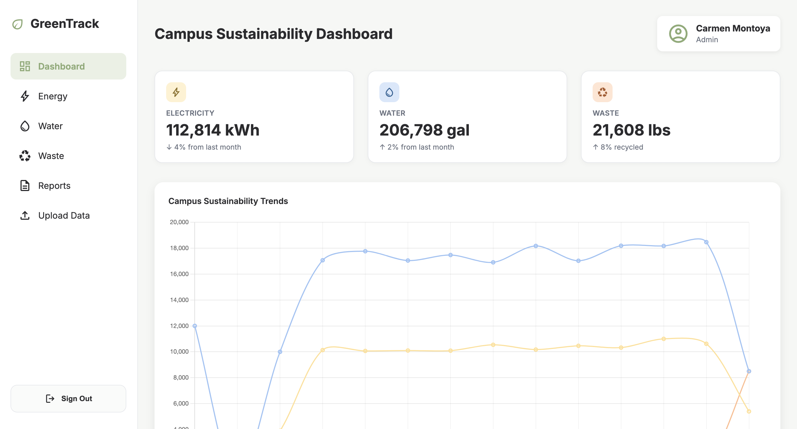
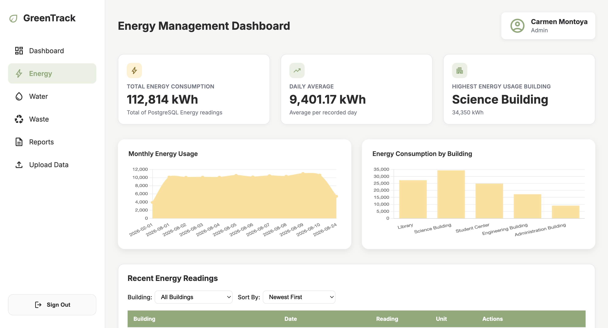
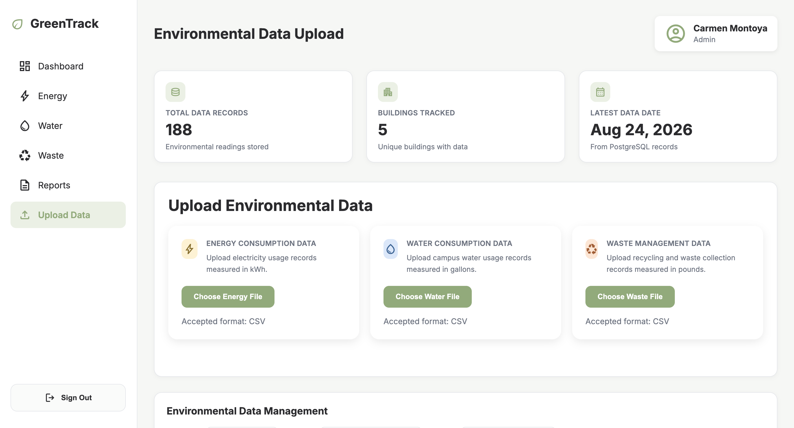
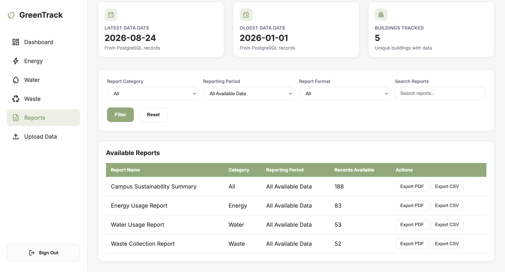

# GreenTrack

GreenTrack is a campus sustainability management system developed for my IT299 Integrative Project. The project addresses a business problem where campus energy, water, and waste data was managed across separate spreadsheets, making it difficult to maintain consistent records, monitor trends, compare historical data, and create reports.

The goal of the project was to plan and develop a centralized technical solution that improves environmental data management and reporting. Throughout the project, I applied project management practices including requirements gathering, stakeholder analysis, project planning, scope management, risk management, testing, issue tracking, and project documentation while also developing a working technical prototype.

## Business Problem

Campus sustainability data for energy, water, and waste was maintained across separate spreadsheets and reporting processes. This created several challenges:

- Environmental data was not centralized
- Records were difficult to manage consistently
- Historical data was difficult to compare
- Sustainability trends were not easily visible
- Monthly reporting required additional manual effort
- Different users required different levels of system access

GreenTrack was designed as a centralized solution to address these challenges while supporting the needs of students, faculty, sustainability staff, and administrators.

## Project Management

GreenTrack was managed from initial business analysis through the development and testing of a working prototype.

Key project management activities included:

- Identified the business problem and project objectives
- Analyzed stakeholder needs and system users
- Defined project scope, constraints, and deliverables
- Developed functional and non-functional requirements
- Created use cases to define system interactions
- Planned system architecture and database structure
- Developed a Work Breakdown Structure (WBS)
- Created wireframes before development
- Tracked project risks and technical issues
- Maintained a bug and issue log during testing
- Defined testing and acceptance criteria
- Performed functional, security, and role-based access testing
- Documented project decisions, testing results, and corrective actions
- Managed changes and improvements throughout the project lifecycle

These activities helped keep the technical solution aligned with the original business goals and user requirements.

## Technical Solution

GreenTrack was developed as a Flask web application connected to a PostgreSQL database. The system centralizes environmental records and provides dashboards and management tools for energy, water, and waste data.

The technical solution includes:

- Centralized PostgreSQL environmental database
- Flask backend and API integration
- Interactive sustainability dashboards
- Energy, Water, and Waste data analysis
- Building-level environmental tracking
- CSV data uploads
- CRUD functionality for environmental records
- Data filtering and sorting
- PDF and CSV report exports
- Role-based access controls
- Data validation
- Responsive web interface

## Project Preview

### Campus Sustainability Dashboard



### Energy Dashboard



### Environmental Data Management



### Sustainability Reports



## Features

- Campus sustainability dashboard with energy, water, and waste summaries
- Interactive visualizations using PostgreSQL data
- Individual Energy, Water, and Waste dashboards
- Building-level environmental data analysis
- CSV uploads for environmental records
- Environmental record editing and deletion
- Filtering and sorting
- Sustainability report filtering
- CSV and PDF report exports
- Role-based access for Admin, Staff, Student, and Faculty users
- Modern and responsive dashboard interface

## Technologies Used

- Python
- Flask
- PostgreSQL
- HTML
- CSS
- JavaScript
- Chart.js

## Project Structure

```text
GreenTrack/
├── data/
│
├── screenshots/
│   ├── dashboard.png
│   ├── energy-dashboard.png
│   ├── data-upload.png
│   ├── sustainability-reports.png
│   └── login.png
│
├── static/
│   ├── css/
│   └── js/
│
├── templates/
│   ├── energy.html
│   ├── index.html
│   ├── login.html
│   ├── reports.html
│   ├── upload.html
│   ├── waste.html
│   └── water.html
│
├── app.py
├── requirements.txt
└── README.md
```

## Dashboard

The main dashboard provides a centralized view of campus sustainability performance. Energy, water, and waste information is retrieved from PostgreSQL and displayed through summary cards, charts, and environmental records.

The visualizations use a consistent color system:

- Energy — Pastel Yellow
- Water — Light Blue
- Waste — Soft Peach
- Green — Primary interface accent

## Environmental Data Management

Authorized users can upload environmental data using CSV files. GreenTrack supports separate uploads for:

- Energy consumption data in kWh
- Water consumption data in gallons
- Waste management data in pounds

Environmental records can also be filtered, sorted, edited, and deleted through the application.

## Reports

The Sustainability Reports page allows users to review environmental information by category and reporting period.

Reports can be exported as:

- CSV
- PDF

Report information is generated from environmental data stored in PostgreSQL.

## Role-Based Access

GreenTrack uses role-based access to support different stakeholder needs while limiting data-management capabilities to authorized users.

### Admin and Staff

- View sustainability dashboards
- Upload environmental data
- Edit records
- Delete records
- Generate reports

### Student and Faculty

- View sustainability dashboards
- View environmental information
- Read-only access to environmental data

## Demo Login Credentials

The following demo accounts can be used to test GreenTrack's role-based access:

| Role | Email | Password |
| --- | --- | --- |
| Admin | admin@greentrack.edu | admin123 |
| Staff | staff@greentrack.edu | staff123 |
| Student | student@greentrack.edu | student123 |
| Faculty | faculty@greentrack.edu | faculty123 |

> **Note:** These credentials are for demonstration purposes only and do not represent real user accounts or sensitive information.

## Database

GreenTrack uses PostgreSQL to centralize environmental information for campus buildings.

The application tracks:

- Building
- Environmental category
- Date recorded
- Reading
- Unit

The three primary environmental categories are Energy, Water, and Waste.

## Project Outcome

GreenTrack demonstrates how a business problem can be translated into requirements, project plans, system designs, testing activities, and ultimately a working technical solution.

The project strengthened my experience in managing the technical project lifecycle while balancing business requirements, stakeholder needs, system functionality, security, testing, and project scope. The final prototype provides a centralized approach to environmental data management while demonstrating both project management and technical implementation skills.

## Author

**Carmen Montoya**

Information Technology Student
